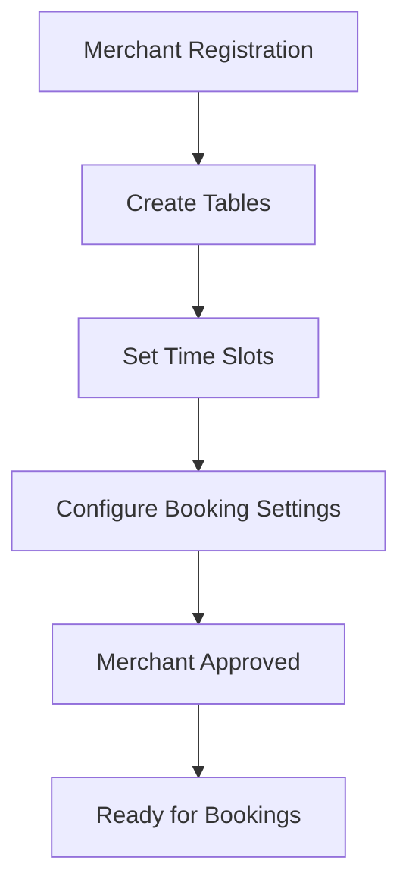
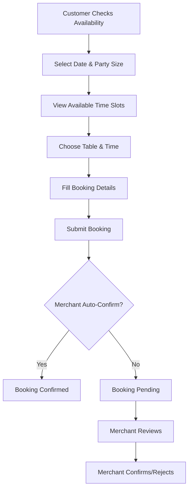

# Table Booking System Documentation

## Overview

The Table Booking System is a comprehensive restaurant reservation platform that allows merchants to manage their tables, time slots, and bookings, while providing customers with an easy way to make reservations. The system includes advanced features like availability checking, booking validation, and merchant-specific policies.

## Architecture

### Database Models

#### 1. Table Model
```typescript
model Table {
  id          Int       @id @default(autoincrement())
  merchantId  Int
  name        String    // Table name/number (e.g., "Table 1", "Booth A")
  capacity    Int       // Maximum number of people
  features    String[]  // Special features (e.g., ["outdoor", "window", "private"])
  status      TableStatus @default(AVAILABLE)
  createdAt   DateTime  @default(now())
  updatedAt   DateTime  @updatedAt

  merchant    Merchant  @relation(fields: [merchantId], references: [id], onDelete: Cascade)
  bookings    Booking[]
}
```

#### 2. TimeSlot Model
```typescript
model TimeSlot {
  id          Int       @id @default(autoincrement())
  merchantId  Int
  dayOfWeek   Int       // 0 = Sunday, 1 = Monday, ..., 6 = Saturday
  startTime   String    // Format: "HH:MM" (e.g., "09:00", "18:30")
  endTime     String    // Format: "HH:MM" (e.g., "10:00", "19:30")
  duration    Int       // Duration in minutes (e.g., 30, 60, 90)
  maxBookings Int       // Maximum bookings per slot (default: 1)
  isActive    Boolean   @default(true)
  createdAt   DateTime  @default(now())
  updatedAt   DateTime  @updatedAt

  merchant    Merchant  @relation(fields: [merchantId], references: [id], onDelete: Cascade)
  bookings    Booking[]
}
```

#### 3. Booking Model
```typescript
model Booking {
  id              Int           @id @default(autoincrement())
  merchantId      Int
  tableId         Int
  timeSlotId      Int
  userId          Int
  bookingDate     DateTime      // Date of the booking (YYYY-MM-DD)
  partySize       Int           // Number of people
  status          BookingStatus @default(PENDING)
  specialRequests String?       // Special dietary requirements, celebrations, etc.
  contactPhone    String?       // Contact phone number
  contactEmail    String?       // Contact email
  confirmationCode String       @unique // Unique confirmation code
  notes           String?       // Internal merchant notes
  confirmedAt     DateTime?     // When booking was confirmed
  cancelledAt     DateTime?     // When booking was cancelled
  cancelledBy     Int?          // User ID who cancelled (null if merchant cancelled)
  createdAt       DateTime      @default(now())
  updatedAt       DateTime      @updatedAt

  merchant        Merchant      @relation(fields: [merchantId], references: [id], onDelete: Cascade)
  table           Table         @relation(fields: [tableId], references: [id], onDelete: Cascade)
  timeSlot        TimeSlot      @relation(fields: [timeSlotId], references: [id], onDelete: Cascade)
  user            User          @relation(fields: [userId], references: [id], onDelete: Cascade)
}
```

#### 4. BookingSettings Model
```typescript
model BookingSettings {
  id                    Int     @id @default(autoincrement())
  merchantId            Int     @unique
  advanceBookingDays    Int     @default(30)  // How many days in advance can book
  minPartySize          Int     @default(1)   // Minimum party size
  maxPartySize          Int     @default(12)  // Maximum party size
  bookingDuration       Int     @default(120) // Default booking duration in minutes
  requiresConfirmation  Boolean @default(true) // Require merchant confirmation
  allowsModifications   Boolean @default(true) // Allow users to modify bookings
  allowsCancellations   Boolean @default(true) // Allow users to cancel bookings
  cancellationHours    Int     @default(24)  // Hours before booking when cancellation allowed
  autoConfirm           Boolean @default(false) // Auto-confirm bookings
  sendReminders         Boolean @default(true)  // Send booking reminders
  reminderHours         Int     @default(2)     // Hours before booking to send reminder
  createdAt             DateTime @default(now())
  updatedAt             DateTime @updatedAt

  merchant              Merchant @relation(fields: [merchantId], references: [id], onDelete: Cascade)
}
```

## API Endpoints

### Merchant Endpoints

#### Table Management
- `GET /api/table-booking/merchant/tables` - Get merchant's tables
- `POST /api/table-booking/merchant/tables` - Create new table
- `PUT /api/table-booking/merchant/tables/:tableId` - Update table
- `DELETE /api/table-booking/merchant/tables/:tableId` - Delete table

#### Time Slot Management
- `GET /api/table-booking/merchant/time-slots` - Get merchant's time slots
- `POST /api/table-booking/merchant/time-slots` - Create time slot
- `PUT /api/table-booking/merchant/time-slots/:timeSlotId` - Update time slot
- `DELETE /api/table-booking/merchant/time-slots/:timeSlotId` - Delete time slot

#### Booking Management
- `GET /api/table-booking/merchant/bookings` - Get merchant's bookings
- `PUT /api/table-booking/merchant/bookings/:bookingId/status` - Update booking status

#### Settings Management
- `GET /api/table-booking/merchant/settings` - Get booking settings
- `PUT /api/table-booking/merchant/settings` - Update booking settings

### Public Endpoints

#### Availability & Booking
- `GET /api/table-booking/merchants/:merchantId/availability` - Get available time slots
- `POST /api/table-booking/bookings` - Create booking
- `GET /api/table-booking/bookings` - Get user's bookings
- `GET /api/table-booking/bookings/:confirmationCode` - Get booking by confirmation code
- `PUT /api/table-booking/bookings/:bookingId` - Update booking
- `DELETE /api/table-booking/bookings/:bookingId` - Cancel booking

## Booking Flow

### 1. Merchant Setup Process



### 2. Customer Booking Process



## Validation Logic

### Input Validation (Zod Schemas)

#### Create Table Schema
```typescript
const createTableSchema = z.object({
  name: z.string().min(1, 'Table name is required'),
  capacity: z.number().int().min(1, 'Capacity must be at least 1').max(20, 'Capacity cannot exceed 20'),
  features: z.array(z.string()).optional().default([])
});
```

#### Create Time Slot Schema
```typescript
const createTimeSlotSchema = z.object({
  dayOfWeek: z.number().int().min(0).max(6),
  startTime: z.string().regex(/^([0-1]?[0-9]|2[0-3]):[0-5][0-9]$/, 'Invalid time format'),
  endTime: z.string().regex(/^([0-1]?[0-9]|2[0-3]):[0-5][0-9]$/, 'Invalid time format'),
  duration: z.number().int().min(15, 'Duration must be at least 15 minutes').max(480, 'Duration cannot exceed 8 hours'),
  maxBookings: z.number().int().min(1).max(10).default(1)
});
```

#### Create Booking Schema
```typescript
const createBookingSchema = z.object({
  tableId: z.number().int().positive('Invalid table ID'),
  timeSlotId: z.number().int().positive('Invalid time slot ID'),
  bookingDate: z.string().regex(/^\d{4}-\d{2}-\d{2}$/, 'Invalid date format'),
  partySize: z.number().int().min(1, 'Party size must be at least 1').max(20, 'Party size cannot exceed 20'),
  specialRequests: z.string().optional(),
  contactPhone: z.string().optional(),
  contactEmail: z.string().email().optional()
});
```

### Business Logic Validation

#### 1. Booking Time Validation
```typescript
async function isBookingAllowed(merchantId: number, bookingDate: string): Promise<{ allowed: boolean; reason?: string }> {
  const settings = await prisma.bookingSettings.findUnique({
    where: { merchantId }
  });

  if (!settings) {
    return { allowed: true }; // No restrictions if no settings
  }

  const bookingDateTime = new Date(bookingDate);
  const now = new Date();
  const daysDifference = Math.ceil((bookingDateTime.getTime() - now.getTime()) / (1000 * 60 * 60 * 24));

  if (daysDifference < 0) {
    return { allowed: false, reason: 'Cannot book for past dates' };
  }

  if (daysDifference > settings.advanceBookingDays) {
    return { allowed: false, reason: `Cannot book more than ${settings.advanceBookingDays} days in advance` };
  }

  return { allowed: true };
}
```

#### 2. Table Availability Check
```typescript
async function checkTableAvailability(tableId: number, timeSlotId: number, bookingDate: string, excludeBookingId?: number): Promise<{ available: boolean; reason?: string }> {
  const table = await prisma.table.findUnique({
    where: { id: tableId },
    include: { merchant: true }
  });

  if (!table) {
    return { available: false, reason: 'Table not found' };
  }

  if (table.status !== 'AVAILABLE') {
    return { available: false, reason: 'Table is not available' };
  }

  const timeSlot = await prisma.timeSlot.findUnique({
    where: { id: timeSlotId }
  });

  if (!timeSlot) {
    return { available: false, reason: 'Time slot not found' };
  }

  if (!timeSlot.isActive) {
    return { available: false, reason: 'Time slot is not active' };
  }

  // Check existing bookings for this table and time slot
  const existingBookings = await prisma.booking.count({
    where: {
      tableId,
      timeSlotId,
      bookingDate: new Date(bookingDate),
      status: { in: ['PENDING', 'CONFIRMED'] },
      id: excludeBookingId ? { not: excludeBookingId } : undefined
    }
  });

  if (existingBookings >= timeSlot.maxBookings) {
    return { available: false, reason: 'Time slot is fully booked' };
  }

  return { available: true };
}
```

## Booking States

| State | Description | Next Possible States |
|-------|-------------|---------------------|
| `PENDING` | Awaiting merchant confirmation | `CONFIRMED`, `CANCELLED` |
| `CONFIRMED` | Approved by merchant | `COMPLETED`, `CANCELLED`, `NO_SHOW` |
| `CANCELLED` | Cancelled by user or merchant | None (terminal state) |
| `COMPLETED` | Booking was fulfilled | None (terminal state) |
| `NO_SHOW` | Customer didn't show up | None (terminal state) |

## Key Features

### For Merchants

1. **Table Management**
   - Create tables with capacity and features
   - Set table status (AVAILABLE, UNAVAILABLE, MAINTENANCE)
   - Update table details and capacity

2. **Time Slot Configuration**
   - Set available hours for each day of the week
   - Configure slot duration and maximum bookings
   - Enable/disable specific time slots

3. **Booking Management**
   - View all bookings with filtering options
   - Update booking status
   - Add internal notes to bookings

4. **Settings Control**
   - Configure advance booking limits
   - Set party size constraints
   - Control booking policies (modifications, cancellations)
   - Enable auto-confirmation

### For Customers

1. **Availability Checking**
   - View available time slots for specific dates
   - Filter by party size
   - See table features and capacity

2. **Booking Management**
   - Create bookings with special requests
   - View booking history
   - Modify existing bookings (if allowed)
   - Cancel bookings (if allowed)

3. **Confirmation System**
   - Receive unique confirmation codes
   - Track booking status
   - Contact information for updates

## Security Features

1. **Authentication**
   - JWT-based authentication for all endpoints
   - Role-based access control (USER, MERCHANT, ADMIN)

2. **Authorization**
   - Merchants can only manage their own tables/bookings
   - Users can only view/modify their own bookings
   - Public availability endpoint doesn't require authentication

3. **Input Validation**
   - Zod schema validation for all inputs
   - Business logic validation for booking constraints
   - SQL injection protection through Prisma ORM

4. **Data Integrity**
   - Unique confirmation codes prevent conflicts
   - Cascade deletes maintain referential integrity
   - Transaction support for complex operations

## Error Handling

### Validation Errors
```typescript
if (error instanceof z.ZodError) {
  return res.status(400).json({ 
    error: 'Validation error', 
    details: error.issues 
  });
}
```

### Business Logic Errors
- Table not available
- Time slot fully booked
- Booking date not allowed
- Party size exceeds limits
- Merchant not approved

### System Errors
- Database connection issues
- Internal server errors
- Authentication failures

## Performance Considerations

1. **Database Indexing**
   - Indexes on frequently queried fields
   - Composite indexes for complex queries
   - Foreign key indexes for joins

2. **Query Optimization**
   - Efficient availability checking
   - Pagination for large result sets
   - Selective field loading

3. **Caching Strategy**
   - Merchant settings caching
   - Time slot availability caching
   - Booking count caching

## Testing

### Test Coverage
- Unit tests for validation schemas
- Integration tests for API endpoints
- End-to-end tests for booking flow
- Performance tests for availability checking

### Test Data Setup
```typescript
async function setupTestData() {
  // Create test merchant
  // Create test tables
  // Create test time slots
  // Create test bookings
}
```

## Deployment Considerations

1. **Environment Variables**
   - Database connection string
   - JWT secret key
   - Server port configuration

2. **Database Migrations**
   - Prisma migration system
   - Schema versioning
   - Rollback procedures

3. **Monitoring**
   - Booking success rates
   - System performance metrics
   - Error tracking and alerting

## Future Enhancements

1. **Advanced Features**
   - Recurring bookings
   - Waitlist management
   - Payment integration
   - SMS/Email notifications

2. **Analytics**
   - Booking patterns analysis
   - Revenue tracking
   - Customer behavior insights

3. **Integration**
   - Calendar synchronization
   - POS system integration
   - Third-party booking platforms

## API Examples

### Create a Table
```bash
POST /api/table-booking/merchant/tables
Authorization: Bearer <merchant_jwt_token>
Content-Type: application/json

{
  "name": "Table 1",
  "capacity": 4,
  "features": ["window", "outdoor"]
}
```

### Check Availability
```bash
GET /api/table-booking/merchants/1/availability?date=2024-01-15&partySize=2
```

### Create a Booking
```bash
POST /api/table-booking/bookings
Authorization: Bearer <user_jwt_token>
Content-Type: application/json

{
  "tableId": 1,
  "timeSlotId": 5,
  "bookingDate": "2024-01-15",
  "partySize": 2,
  "specialRequests": "Vegetarian options needed",
  "contactPhone": "+1234567890",
  "contactEmail": "customer@example.com"
}
```

This documentation provides a comprehensive overview of the table booking system, including its architecture, API endpoints, validation logic, and usage examples.
